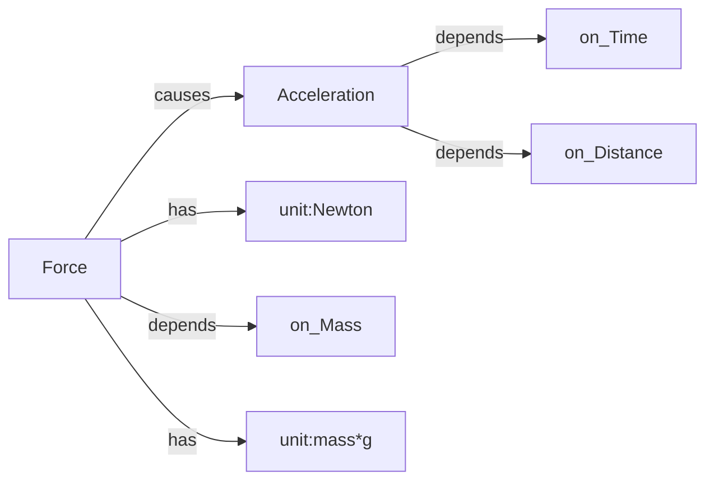

First Universal Object model.xml  = ontology / capabilities

1. Theme of search "Melodic Phrase"
   FIND SOURCES (Wikipedia, Papers, YouTube)
2. UNIVERSAL OBJECT MODEL
   Defines Model /Specialization / Instance / Variation
3. OBJECT INVENTORY (Word Model, Syllable Model, Sound Model
4. OBJECT LIBRARY                             
     Word Instances,Syllable Instances,Sound Instances
5. BLUEPRINTS(HTML,PDF,DOCX)

