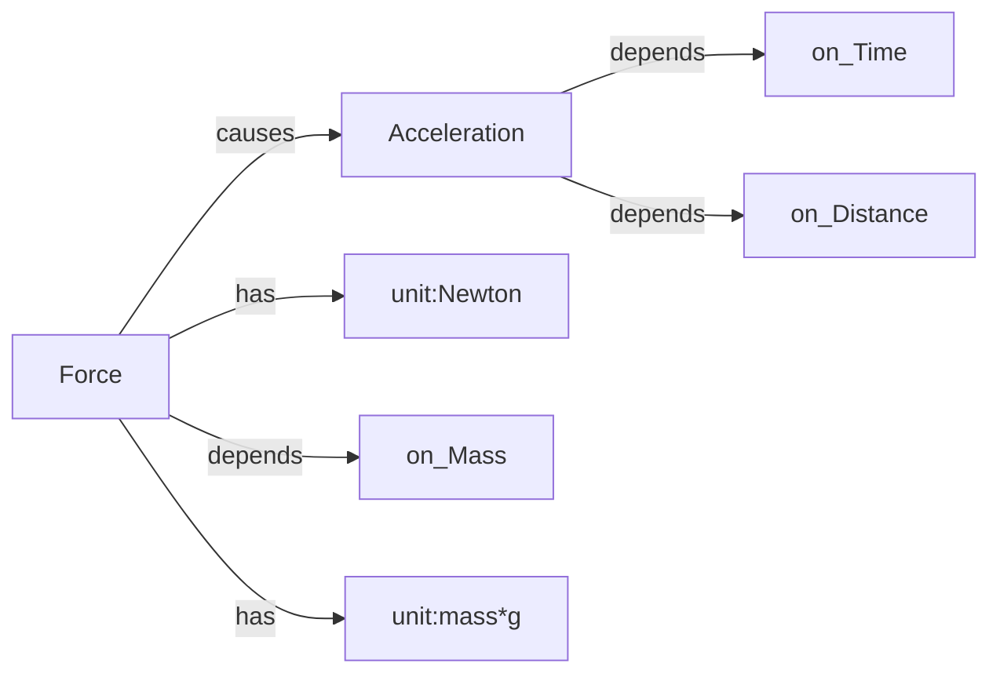

First Universal Object model.xml  = ontology / capabilities

1. Theme of search "Melodic Phrase"
   FIND SOURCES (Wikipedia, Papers, YouTube)
2. UNIVERSAL OBJECT MODEL
   Defines Model /Specialization / Instance / Variation
3. OBJECT INVENTORY (Word Model, Syllable Model, Sound Model
4. OBJECT LIBRARY                             
     Word Instances,Syllable Instances,Sound Instances
5. BLUEPRINTS(HTML,PDF,DOCX)


```mermaid
classDiagram
    class Xenon {
        +symbol Xe
        +atomic_number 54
        +relative_atomic_mass 131.293 u
        +boiling_point -108.099_C
        +melting_point -111.75_C
        +atmospheric_concentration 0.086_ppmv
        +discovery_year 1898
        +physical_state gas
        +colourless true
        +odourless true
    }

    class NobleGas {
        +classification noble_gas
    }

    class Earth'sAtmosphere {
        +contains Xenon
    }

    class PhysicalProperties {
        +excitation produces blue_light
        +boiling_point at 1_atm
        +melting_point at 1_atm
    }

    class LightSources {
        +specialised_lighting
        +photographic_flash_lamps
    }

    class IonPropulsion {
        +propellant Xenon
        +accelerates Xenon_ions
    }

    class LiquidParticleDetectors {
        +detection_medium liquid_xenon
    }

    class LUXZEPLIN {
        +searches_for candidate_dark_matter_particles
    }

    class PubChem {
        +provides chemical_identity
        +provides atomic_number
        +records discovery
    }

    class RoyalSocietyOfChemistry {
        +provides physical_properties
        +provides atmospheric_data
    }

    class NASA {
        +documents ion_propulsion
    }

    class Reuters {
        +reports particle_physics_research
    }

    Xenon --|> NobleGas : belongs to
    Earth'sAtmosphere --> Xenon : contains
    Xenon --> PhysicalProperties : has
    Xenon --> LightSources : used in
    Xenon --> IonPropulsion : used as propellant
    Xenon --> LiquidParticleDetectors : used in
    LiquidParticleDetectors --> LUXZEPLIN : used by
    LUXZEPLIN ..> Xenon : uses liquid xenon
    LUXZEPLIN ..> DarkMatter : searches for

    PubChem ..> Xenon : identity and discovery
    RoyalSocietyOfChemistry ..> Xenon : physical properties
    NASA ..> IonPropulsion : application source
    Reuters ..> LUXZEPLIN : research reporting

    class DarkMatter {
        +status candidate_search_target
    }
```
