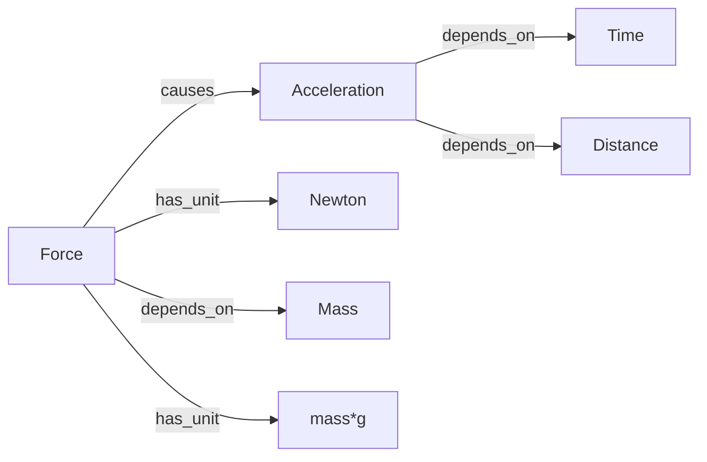
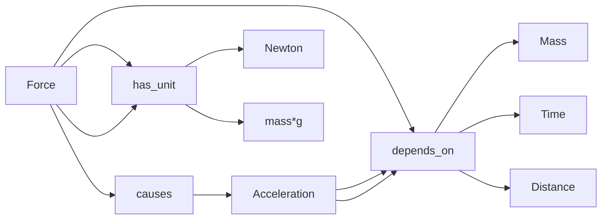

First Universal Object model.xml  = ontology / capabilities
LINGVO OBJECT MODEL.xml  = schema / construction rules
Cat.xml  = actual object instance.

1.Theme of search "Melodic Phrase"
1.1 FIND SOURCES (Wikipedia, Papers, YouTube)
2. UNIVERSAL OBJECT MODEL
   Defines Model /Specialization / Instance / Variation
3. OBJECT INVENTORY (Word Model, Syllable Model, Sound Model)
          └── allows → Syllable Model 
4. OBJECT LIBRARY                             
     Word Instances     Syllable Instances   Sound Instances
          └── contains → Syllable Instance
5. BLUEPRINTS( HTML          PDF          DOCX)

1. Universal Object
2. Universal Object Models
3. Object Types / Specialization
4. Object Class
5. Object Instances
6. Relations between Instances
7. Systems composed of Instances

